# Model-Based Method - Dynamic Programming

## Introduction
In this session, you'll learn the most basic strategy in reinforcement learning (**Dynamic Programming**) to compute optimal policies **given the model of the environment**. You'll learn that there are two basic steps for solving any RL problem.
* **Policy evaluation** refers to the iterative computation of the value functions for a given policy.
* **Policy improvement** refers to finding an improved policy given the value function for an existing policy.

You'll learn about two basic approaches to solve an RL problem:
* **Policy Iteration** and
* **Value Iteration**

### Dynamic Programming
**Dynamic Programming (DP)** is a method of solving complex problems by breaking them into sub-problems. It solves the sub-problems and stores the solution of sub-problems, so when next time same subproblem arises, one can simply look up the previously computed solution.

Why should you apply dynamic programming to solve Markov Decision Process?

1. **Bellman equations are recursive in nature.** You can break down Bellman equation to two parts – (i) optimal behaviour at next step (ii) optimal behaviour after one step
2. You can **cache the state value and action value functions** for further decisions or calculations.

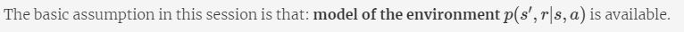

**Additional Reading**
You can read more on Dynamic Programming [here](https://web.stanford.edu/class/cs97si/04-dynamic-programming.pdf).

### Policy Iteration
In the previous session, we saw the Bellman equations of expectation and optimality. Now, we will look at how to learn the optimal policy and the corresponding state and action-value functions. There are broadly two techniques to do so:
* Policy Iteration
* Value Iteration

In the upcoming segments, you’ll learn both these methods in detail. Let's start with **Policy Iteration**.

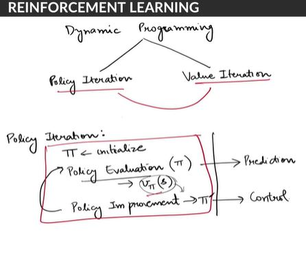

Policy iteration has three main steps:
1. **Initialize a policy** randomly
2. **Policy Evaluation**:

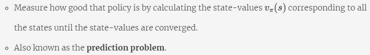

3. **Policy Improvement:**
* Make changes in the policy you evaluated in the policy evaluation step.
* Also known as the **control problem**.
 
The new policy you get after the policy improvement step then goes through the policy evaluation step again.

### Policy Iteration - Algorithm
Let’s now understand the **policy iteration algorithm**, i.e. policy evaluation and policy improvement, in detail.

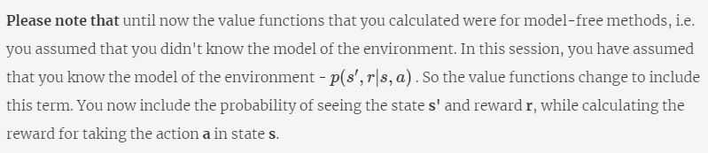

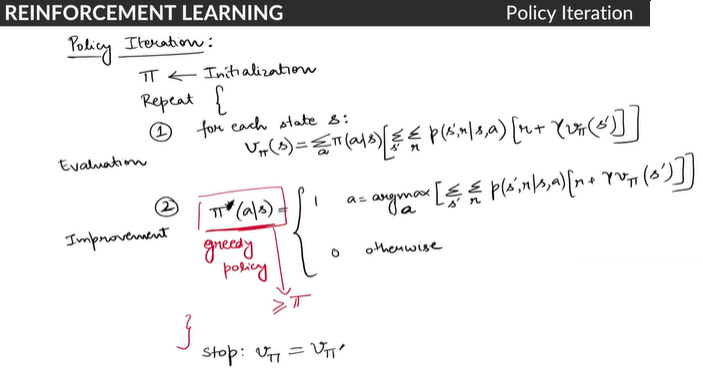

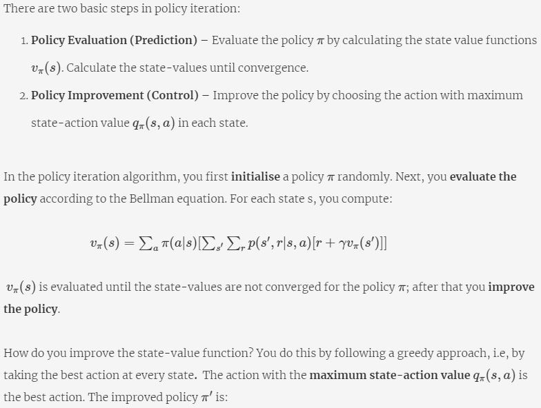

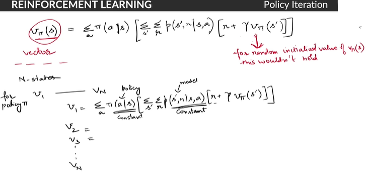

Thus, apart from initializing the policy, you also **initialize the state-value function** randomly.

Let's say that you have N states. In the policy evaluation step, you can write the value function for each state as:

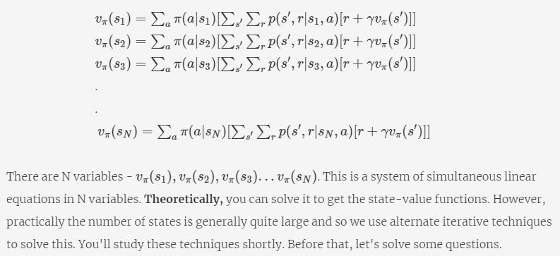

### Policy Iteration - Comprehension
Consider a self-driving car being trained in a small **4x4** grid. All the obstacles, i.e., the pedestrian and the tree, are stationary. When the car runs into the wall (boundaries of the GridWorld), it ends up at the same location. The objective of the agent is to find an **optimal path to the goal** using policy iteration. An episode terminates if the agent runs into an obstacle or reaches the goal. The values of terminal states are 0, i.e., v(s) = 0.

**Assumption:** The environment is deterministic, i.e., given the state and the action, the agent will transition only to one particular state.

### Formulating the MDP
The most important step while solving an RL problem is formulating the MDP. You can think of MDP as the simulation of the environment, which decides the consequence of the agent's action. Let's start with it.

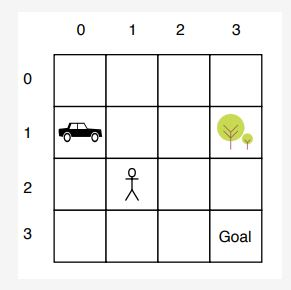

For creating the MDP environment, you need to specify states, actions, reward structure, transition probabilities and terminal states (to decide when the episode will end).

Please note that the state here is represented as (row no., column no.)

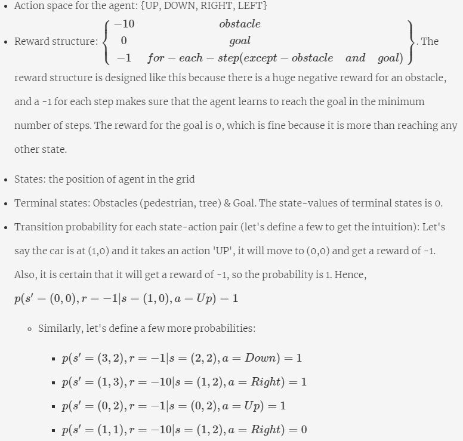

Note that these transition probabilities basically represent the model of the environment.

Now, the GridWorld environment is created. It's time for the agent to learn the best **policy** to reach the Goal via policy iteration.

### Policy Evaluation - Prediction
Recall, that you obtain a system of equations in the policy evaluation step can be solved in two ways - closed form solution and iterative solution. Let's explain them in the following segment.

**Please note that** a closed form solution is one where you can solve the system of linear equations mathematically, in this case, via matrix manipulation.

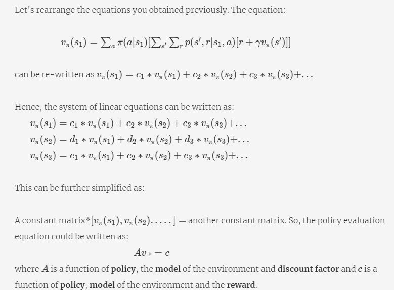

These equations could be solved using matrix inverse. This approach is computationally expensive and is not suitable when the number of states is huge.

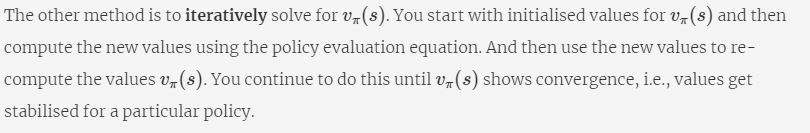

You will do policy evaluation for a GridWorld problem later in the session.

**Convergence in Policy Evaluation - Optional**
The state-values start to stabilise after some time. To understand why the state-values converge.

### Policy Improvement - Control
After evaluating the policy, let's now see how **policy improvement** is done.

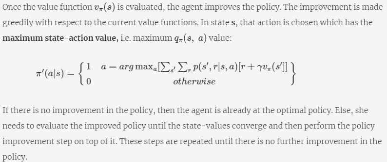

### Example - GridWorld
Let's try to understand the policy improvement procedure through the following example.

Consider this small 3x3 grid. Say for some arbitrary policy π; the state-value functions are as follows (the numbers in the grid represent the state-values of the corresponding state):

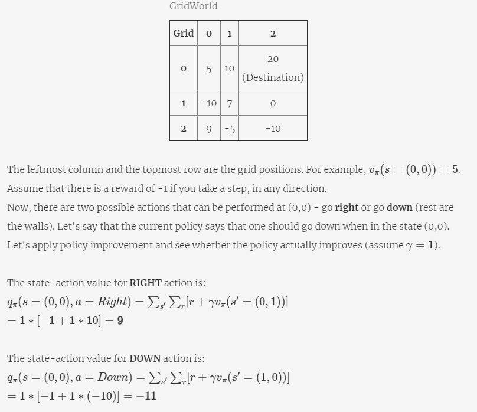

So, the best action, in this case, is to move RIGHT. The improved policy for s=(0,0) will be to move RIGHT, instead of going DOWN as according to the current policy. Similarly, you do the policy improvement for all the states.

On the next page, you will perform both the steps of policy iteration on a GridWorld problem. This will serve as a very good example to help you grasp the concept thoroughly.

### Policy Iteration - GridWorld
Let's learn to find the optimal policy using the policy iteration algorithm using the **GridWorld** setting. The agent is again the self-driving car. Please note that the state is represented as (row no., column no.).

The GridWorld is the same.

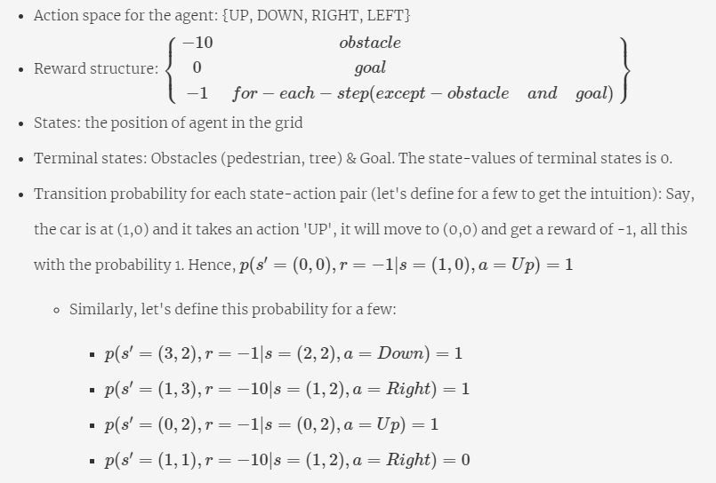

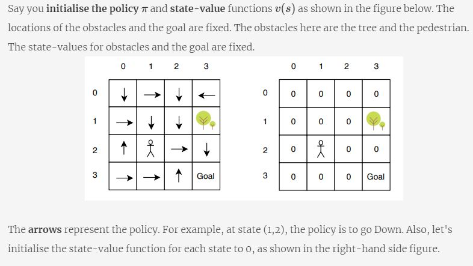

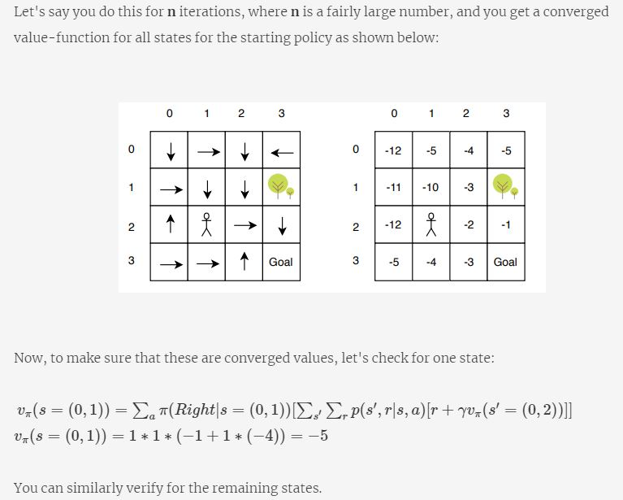

### Policy Improvement
Let's now do policy improvement using the current value-estimates.

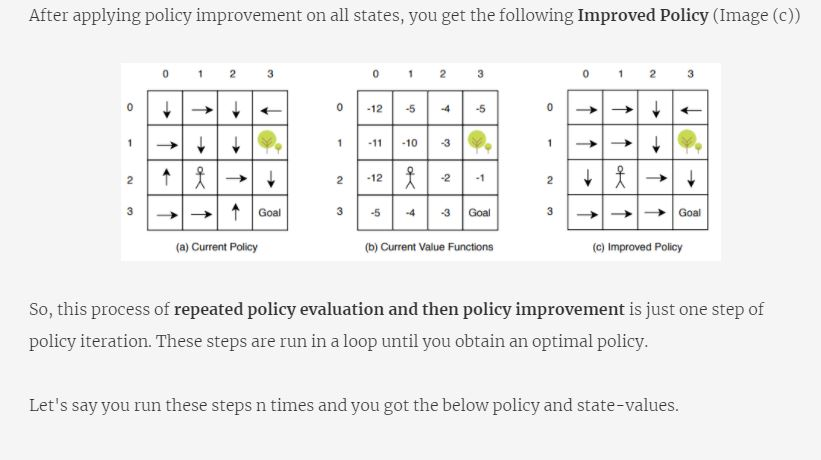

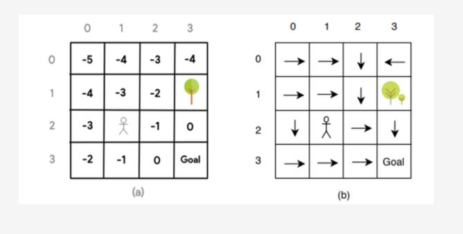

Let's understand the results of policy iteration. What did the agent learn?

The optimal policy, in this case, is the ideal direction to move when at some grid position. Say, after training, you put the car at (0,2). It should now know the optimal path to reach the goal since it has learnt the value of each state.

The optimal path would be to move in a **direction where the state-value is better than the current state-value**: (0,2) ->(1,2) ->(2,2) ->(2,3) ->(3,3). So, the car should know what ("optimal") action it should take at every state.

This example illustrates how the policy iteration procedure works. You saw how you can improve a deterministic policy to arrive at an optimal solution.

### Policy Iteration for Stochastic Policy - Optional
You can start with a stochastic policy as well and follow similar steps to arrive at the optimal policy. We will not cover the stochastic policies in this course. However, you can refer here to see how to solve a similar GridWorld environment using a stochastic policy. This part is completely optional. 

### Value Iteration
Before you move ahead with **Value Iteration** algorithm, let's build an intuition of it by solving the following questions:

Consider the state (2, 0). As shown in the figure, under the current policy the agent would move UP from (2, 0), the value of (2, 0) is -12, and under the improved policy, the agent moves DOWN to (3, 0).

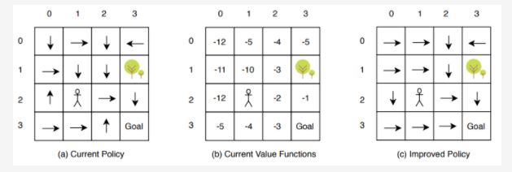

So you saw that you can compute the maximum value of a state by comparing the different actions possible in that state - the action which results in the max state-value is the optimal action. This is the major idea behind **Value Iteration** algorithm. 

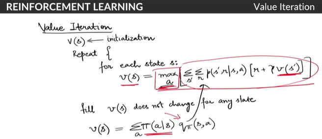

In value iteration, instead of running the policy evaluation step till the state-values converge, you perform **exactly one update**, calculating the state-values. These state-values are corresponding to the action that yields the **maximum state-action value**. The state-value function is a greedy choice among all the current actions:

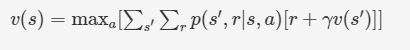

Policy improvement is an implicit step in state-value function update. The update step combines the **policy improvement** and (truncated) **policy evaluation steps**. 

### Generalised Policy Iteration (GPI)
Policy Iteration and Value Iteration are two sides of a coin.

In **policy iteration**, you complete the entire policy evaluation to get the estimates of value functions for a given a policy and then use those estimates to improve the policy. And then repeat these two steps, until you arrive at optimal state value function.

In **value iteration**, for every state update, you’re doing a policy improvement, i.e., updating the state value by picking the most greedy action using current estimates of state-values.

**Generalised Policy Iteration (GPI)** is a class of algorithms that pans out the entire range of strategies that fall between Policy Iteration & Value Iteration. A GPI is basically the following two steps running in a loop
1. Updates based on current values
2. Policy improvement

The following example will give you a gist of one such possible GPI Method. Let's take the GridWorld example. 

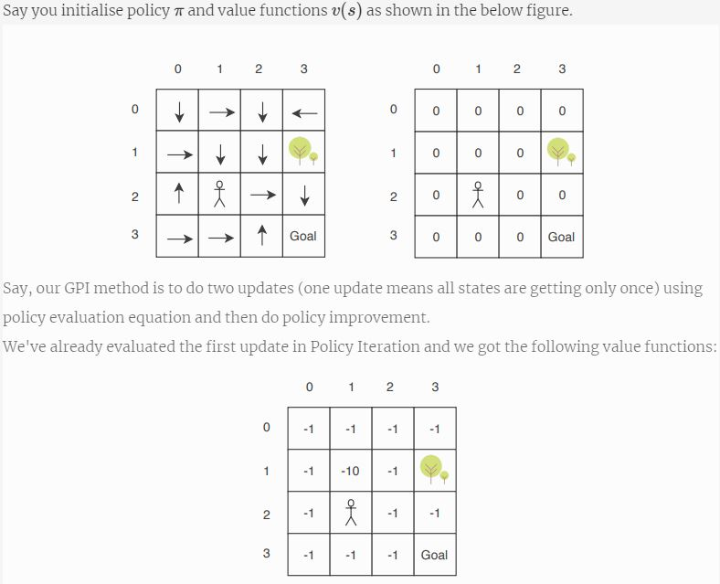

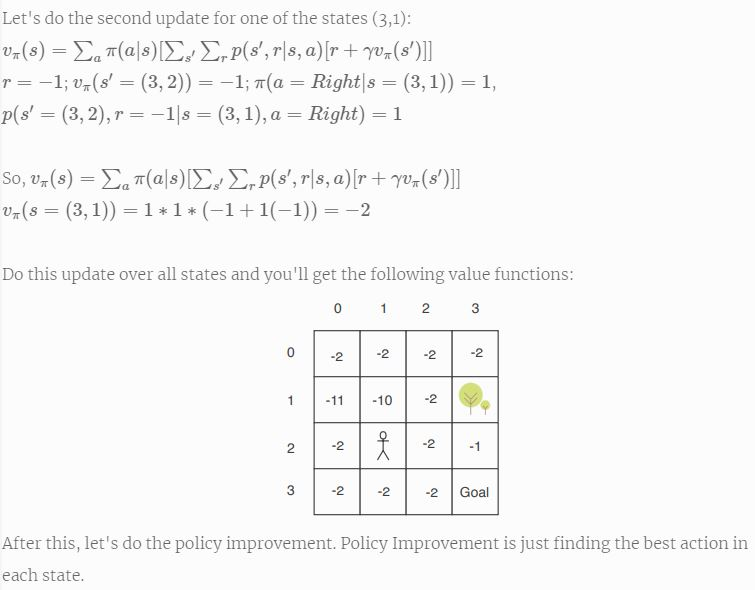

After doing policy improvement for each state, the improved policy you arrive at is:

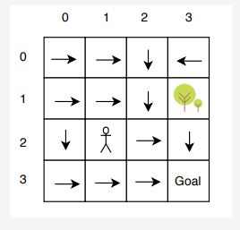

Compare this with the policy we derived in Policy Iteration after the entire sweep over states. Here, we've done two sweeps and arrows are already pointing in the optimal direction. 

This is Generalised Policy Iteration. You can try any other method that range between Value & Policy Iteration and that is guaranteed to converge to optimality.

### Ad Placement Optimization (Demo) -I
Placement of ads on a website is the primary problem for companies that operate on ad revenue. The position where the ad is placed plays a pivotal role in whether or not the ad will be clicked.

Here we have the following choices:
1, Place them randomly, or
2. Place the ad on the same position

The problem with placing the ad on the same position is that the user, after a certain time, will start ignoring the space since he's used to seeing the ad at that place and will end up ignoring that particular position hereafter. This will reduce the number of clicks on ads.

The problem with the former option, i.e. placing them randomly, is that it wouldn't take optimal positions into consideration. For instance, if you place an ad beside a text, the chances of it being seen is higher than if an ad is placed randomly. It is infeasible to go through every website and repeat the procedure.

Let's see how you can solve this problem using reinforcement learning.

You can download the notebook from below:

[Ad Placement Optimization](data/Ad+Placement+Optimization_RL.ipynb)

### Why Use Reinforcement Learning
The problem of maximising click-through rate (CTR) is not a reinforcement learning problem intrinsically. We could have applied some machine learning technique but there are some bottlenecks. it requires: 
1. Huge data
2. Features
3. Tuning of many hyperparameters

You neither have a huge data, nor features. The only data you have is the position of the ad and whether or not it was clicked.

Please download the dataset from here: [Ad placement dataset from Kaggle](https://www.kaggle.com/akram24/ads-ctr-optimisation)

Let's understand the dataset.

If you were to not use reinforcement learning, you would have placed the ads randomly or at the position where maximum ads were clicked.

Let's see the results of these two policies first.

### Ad Placement Optimization (Demo) -II
Before starting with the policy iteration algorithm, let's understand the notion of an episode in this Ad placement problem. It's recommended that you analyse the code first and then watch the video.

So, the MDP for Ad placement is defined:
* State: URL ID
* Action- to place the ad at one of the 10 positions on the webpage
* Reward- If the ad is clicked on the webpage then a reward of +1, else 0
* Transition probabilities- From any webpage, he can land to any of the (n-1) web pages, where n is the total number of webpages. So, the p(s'|s,a) =1/9999

Now, let's apply Policy Iteration algorithm to the problem.

The policy iteration algorithm learns for each webpage what is the best position. For example, for webpage 1, it learns that placing the ad at Position 1, 5, 9 will result in a click. Similarly, it learns the exact solution for each of the other web pages.

This brings us to the end of the policy iteration algorithm. You can try modifying the policy iteration code to make it value iteration.

In the next session, you'll learn about the model-free methods.